# Frontend Technical Design Document (FTD) — Career Document Hub

## 1. Executive Summary & Technical Scope

### 1.1 Document Purpose
This document provides a comprehensive technical blueprint of the frontend architecture for the **Career Document Hub**. It describes the implementation details, directory organization, state propagation channels, page configurations, error validation models, and integration points for the client application. It serves as an onboarding guide and implementation checklist for engineers.

### 1.2 Tech Stack Reference
*   **Core UI Library**: React 18+ (using functional components and hooks).
*   **Build Tool**: Vite (configured for rapid Hot Module Replacement and modular chunk bundling).
*   **Routing**: React Router DOM v6 (declarative browser routing, nested layout route nesting, and protective guard wrappers).
*   **Styling**: Vanilla CSS (enhanced with CSS custom properties/variables to enable theme switching).
*   **Toast System**: `react-hot-toast` (dynamic, responsive notifications synchronized with theme contexts).
*   **AI Integration**: Direct HTTPS requests using Fetch API against Groq Cloud completions endpoints.
*   **State & Cache Layers**: React Context API coupled with raw browser storage APIs (`localStorage` and `sessionStorage`).

---

## 2. Application Architecture

The system utilizes a client-centric model where all data storage, layout processing, signature styling, and API routing occur in the user's browser. The application layout is wrapped in state providers that supply active user contexts and styling choices to child components.

### 2.1 High-Level Architecture Diagram
This diagram outlines the flow of user actions down through the application layers.

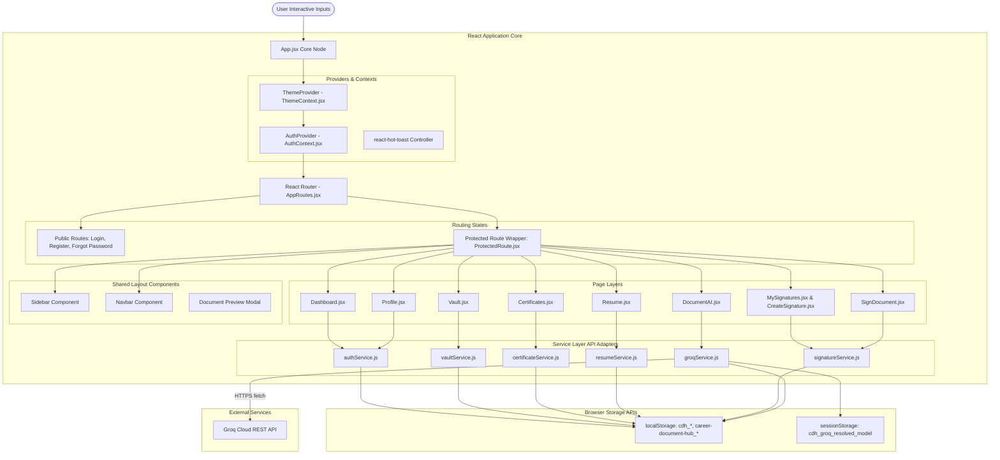

### 2.2 System Component Block Diagram
This block diagram outlines the breakdown of logical layers: user view, routing controller, application state, and storage service adapter.

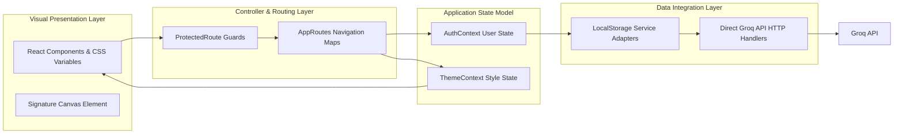

---

## 3. Folder Structure

The code directory is structured inside the `frontend/` folder, separating views, routing definitions, providers, custom state hooks, and persistence adapters:

```text
frontend/src/
├── assets/             # Static images, logo vectors, and base graphic assets
├── components/         # Reusable presentation and layout components
│   ├── auth/           # AuthHeader, PasswordStrength components
│   ├── certificates/   # AddCertModal, CertCard components
│   ├── common/         # Custom modular Buttons, Inputs, Modals, and ThemeToggle
│   ├── dashboard/      # RecentDocuments, RecentSignatures, StatCard components
│   ├── documentAI/     # Setup panels, modal configurations, ChatTab, SummaryTab views
│   │   └── insights/   # RedFlagsAndRisks, ObligationsAndRules, DatesAndFinances
│   ├── documents/      # Signature overlays, canvas backgrounds, upload drops
│   ├── expiry/         # Expiry alert rows
│   ├── layout/         # Header Navbar, Sidebar navigation, and Route guards
│   ├── profile/        # Account details and cache/database deletion dialogs
│   ├── resume/         # Resume builder inputs structure grids and layout previews
│   └── signature/      # Preset grids, custom lettering styles, upload selectors
├── context/            # Shared React context files managing global state
│   ├── AuthContext.jsx # Handles user verification and profile syncing
│   └── ThemeContext.jsx# Handles light, dark, and system color settings
├── hooks/              # Custom hooks encapsulating component state & behaviors
│   ├── useChatState.js       # Coordinates conversations chat turns and suggested questions
│   ├── useDocumentAIState.js # Tracks active analysis steps and Groq verification states
│   ├── useDocumentUpload.js  # Implements type checks and base64 parsing size guards
│   ├── usePdfRenderer.js     # Extracts pages text and translates first page to images
│   ├── useResumeState.js     # Drives form lists additions, prints, and debounced saves
│   └── useSignatureCanvas.js # Manages drawing coordinates and brush variables
├── pages/              # Clean modular page containers (under 150 lines)
│   ├── auth/           # Login, Register, ForgotPassword
│   ├── Certificates.jsx
│   ├── CreateSignature.jsx
│   ├── Dashboard.jsx
│   ├── DocumentAI.jsx
│   ├── Documents.jsx
│   ├── Expiry.jsx
│   ├── MySignatures.jsx
│   ├── Profile.jsx
│   ├── Resume.jsx
│   ├── SignDocument.jsx
│   └── Vault.jsx
├── routes/             # Client routing mapping configurations
│   └── AppRoutes.jsx   # Declares public and protected routes
├── services/           # Services isolating localStorage & Groq APIs from UI views
│   ├── authService.js
│   ├── certificateService.js
│   ├── documentService.js
│   ├── groqService.js  # Verified Mock / Actual Groq Cloud API adapter
│   ├── resumeService.js
│   ├── signatureService.js
│   └── vaultService.js
├── styles/             # CSS variable sets and normalization properties
├── utils/              # Signature merger and drawing utility algorithms
├── App.css             # Main styling rules and layout utilities
├── App.jsx             # Root layout wrapping Context Providers
├── index.css           # Global theme styling custom variables
└── main.jsx            # Mounts React to the DOM
```

---

## 4. Component Architecture & Hierarchy

The application root mounts global contexts, which wrap around the navigation router and layout framework.

```
App (Routes, Contexts, Notification Toaster)
 └── ThemeProvider (Theme Context)
      └── AuthProvider (User Session Context)
           └── AppRoutes (React Router Map)
                ├── Public Pages
                │    ├── Login (Auth wrapper UI)
                │    ├── Register (Auth wrapper UI)
                │    └── ForgotPassword (Simple fallback page)
                │
                └── ProtectedRoute Wrapper (Validates user session, redirects to /login if empty)
                     └── Layout Container (Sidebar + Header Nav + Page Panel)
                          ├── Sidebar (Responsive link matrix, theme cycle button)
                          ├── Navbar (Shows breadcrumbs, active notifications, and profile details)
                          └── Page Component Container
                               ├── Dashboard (Card metrics, action lists, overview tables)
                               ├── Vault (Categorized list of files, search inputs, metadata previews)
                               ├── Certificates (Issuer badges, credentials link, edit modals)
                               ├── Expiry (Calendar view of upcoming certification renewals)
                               ├── ResumeBuilder (Form entry fields + print preview element)
                               ├── MySignatures (Grid of signatures, delete actions)
                               ├── CreateSignature (Drawing canvas + typed lettering panel)
                               ├── Documents (Signed/unsigned workspace, sign button trigger)
                               ├── SignDocument (Canvas renderer overlays signature stamps)
                               ├── DocumentAI (API validation form, chat UI, details list)
                               └── Profile (User info edit settings, storage clear tool)
```

---

## 5. State Management Design

Global parameters like current user configurations and visual styling themes use the React Context API to avoid prop drilling.

### 5.1 Auth Context State Flow
Coordinates session tracking, profile updates, and logout actions.

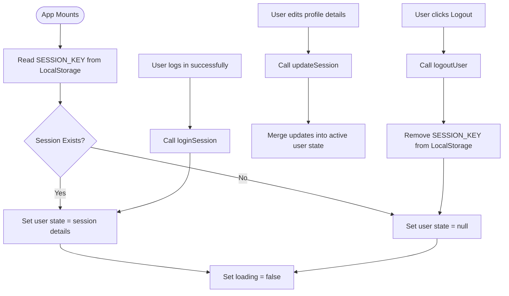

### 5.2 Theme Context State Flow
Cycles between light, dark, and system themes, applying styles by updating variables in the document head.

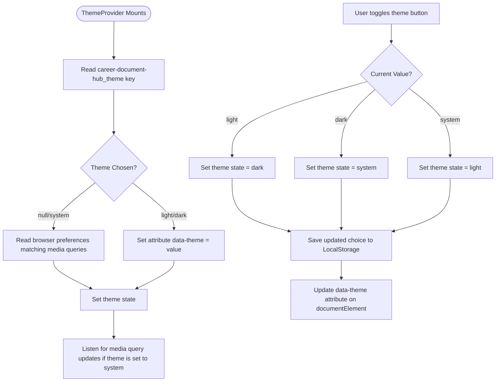

---

## 6. Routing Architecture

All navigation is managed by React Router DOM. Public paths are open to all users, whereas private workspaces are protected by session checks.

| Route Path | Associated Page | Access Guard | Primary Responsibility |
| :--- | :--- | :--- | :--- |
| `/login` | `Login.jsx` | Public | Validates login forms, initializes session tokens. |
| `/register` | `Register.jsx` | Public | Validates user sign-ups, checks for duplicate emails. |
| `/forgot-password` | `ForgotPassword.jsx` | Public | Simple mock screen showing simulated password reset instructions. |
| `/dashboard` | `Dashboard.jsx` | Protected | Displays high-level metrics, upcoming certificate renewals, and pending tasks. |
| `/vault` | `Vault.jsx` | Protected | Provides categorized file uploads, metadata search, and previews. |
| `/certificates` | `Certificates.jsx` | Protected | Manages online credentials and certificate information. |
| `/expiry` | `Expiry.jsx` | Protected | Lists expiring documents sorted by days remaining. |
| `/resume` | `Resume.jsx` | Protected | Entry fields for work details alongside live ATS-formatted PDF preview. |
| `/signatures` | `MySignatures.jsx` | Protected | Grid of saved signatures with option to set a default. |
| `/signatures/create` | `CreateSignature.jsx` | Protected | Provides signature drawing pad, custom text typing, or file upload. |
| `/documents` | `Documents.jsx` | Protected | Workspace showing signed/unsigned files and download actions. |
| `/documents/:id/sign` | `SignDocument.jsx` | Protected | Workspace to position and burn a signature overlay onto a document. |
| `/ai` | `DocumentAI.jsx` | Protected | AI document extraction hub and context-aware chat interface. |
| `/profile` | `Profile.jsx` | Protected | Profile management, display settings, and app data clear actions. |

---

## 7. Theme System Design

Theme options are defined using CSS custom properties (`--bg-primary`, `--text-primary`, `--border-color`, etc.) in `src/index.css`. The `ThemeProvider` updates the `data-theme` attribute of the `<html>` node to switch styles.

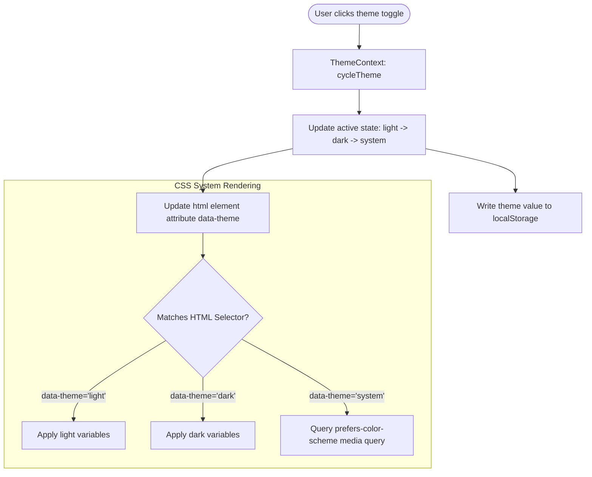

---

## 8. Screen Documentation

### 8.1 Authentication Screens (`/login`, `/register`)
*   **Purpose**: Log in users or register new profiles.
*   **Core Components**: Standard Form panels, text inputs, error message callouts, and submit buttons.
*   **Inputs**:
    *   Name (Register only) - Required, min 2 chars.
    *   Email - Required, must match standard email formats.
    *   Password - Required, min 6 chars.
    *   Remember Me checkbox (Login only) - Caches email in storage.
*   **Outputs**:
    *   Initializes user session context.
    *   Updates local user arrays inside browser storage.
*   **Validation Rules**: Form validation checks email structure and password length.

### 8.2 Dashboard Workspace (`/dashboard`)
*   **Purpose**: Overview of the application state and quick actions.
*   **Core Components**: Metric Cards, alert lists, and action buttons.
*   **Inputs**: None.
*   **Outputs**: Visual indicators of document types, expiry warnings, and link shortcuts.
*   **User Actions**: Quick navigation links, checking alerts, and file upload triggers.

### 8.3 Document Vault (`/vault`)
*   **Purpose**: File repository supporting search, tagging, and filtering.
*   **Core Components**: Drag-and-drop file upload, search input, category filters, and document preview modals.
*   **Inputs**:
    *   File Upload (PDF/Image) - Max size 5MB.
    *   Document Name - Required, text input.
    *   Category - Dropdown selection.
    *   Tags - Comma-separated text input.
    *   Notes - Textarea input.
    *   Expiry Date - Optional date picker.
*   **Outputs**: Saves base64 document items to local storage.
*   **User Actions**: Filtering lists, search queries, toggle favorites, and deleting files.

### 8.4 Resume Builder (`/resume`)
*   **Purpose**: Form builder that generates print-ready PDF resumes.
*   **Core Components**: Multi-step entry form, array add/remove lists, and real-time print-preview pane.
*   **Inputs**:
    *   Personal info: name, email, phone, links, summaries.
    *   Education details: school, degree, dates, score.
    *   Work experience: employer, title, description, dates.
    *   Project details: title, technologies, description.
    *   Skills: categorized comma-separated values.
*   **Outputs**: Auto-saves entries to local storage; triggers browser print styling for PDF download.
*   **Validation Rules**: Real-time validation checks for valid dates and email formatting.

### 8.5 Signature Creator (`/signatures/create`)
*   **Purpose**: Create and store digital signatures.
*   **Core Components**: Custom HTML5 signature canvas, typed calligraphy list, and image upload area.
*   **Inputs**:
    *   Signature Name - Text input.
    *   Drawing Canvas - Mouse/touch paths.
    *   Typed Text - Text input with font family selectors.
    *   Signature Upload - Image file selector (PNG with transparent background).
*   **Outputs**: Saves base64 PNG signatures to local storage.
*   **Validation Rules**: Canvas must contain active paths before saving; file size limit of 1MB for image uploads.

### 8.6 Document Signer (`/documents/:id/sign`)
*   **Purpose**: Apply a saved signature to an uploaded document.
*   **Core Components**: Signature positioning panel, draggable signature overlays, and output compilation canvas.
*   **Inputs**:
    *   Signature Stamp Selection.
    *   Signature position coordinates (X/Y) via mouse drag-and-drop.
    *   Signature scaling slider.
*   **Outputs**: Saves the signed document as a base64 PNG/PDF to local storage.
*   **Validation Rules**: A default signature must be available, and coordinates must sit within document boundary limits.

### 8.7 AI Insights (`/ai`)
*   **Purpose**: AI-powered document extraction and analysis.
*   **Core Components**: Groq API Key panel, document dropdown selector, analysis detail tabs, and chat message thread.
*   **Inputs**:
    *   API Key - Text input.
    *   Document Selection - Dropdown of uploaded files.
    *   Chat Input - Query text.
*   **Outputs**: Saves structured JSON analysis and chat threads to local storage.
*   **Validation Rules**: Valid API key required.

---

## 9. Data Flow Diagrams (DFD)

### 9.1 Level 0 DFD (System Overview)
This diagram illustrates the flow of files and metadata through the frontend system.

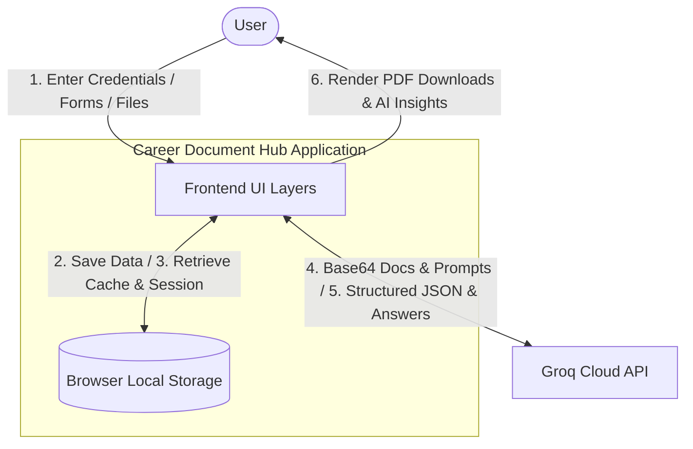

### 9.2 Level 1 DFD (Decomposed Core Processes)
This diagram shows how data flows between UI views, application contexts, and service controllers.

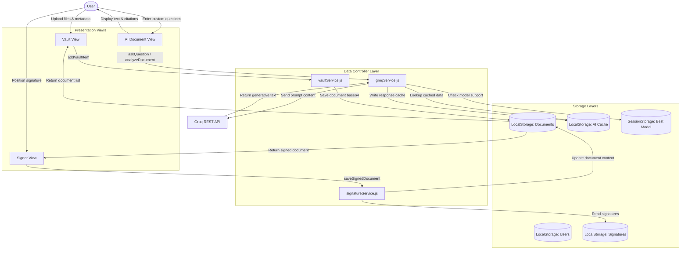

---

## 10. Control Flow Diagrams

### 10.1 User Authentication Control Flow
This diagram illustrates the login decision paths, session validation, and redirects.

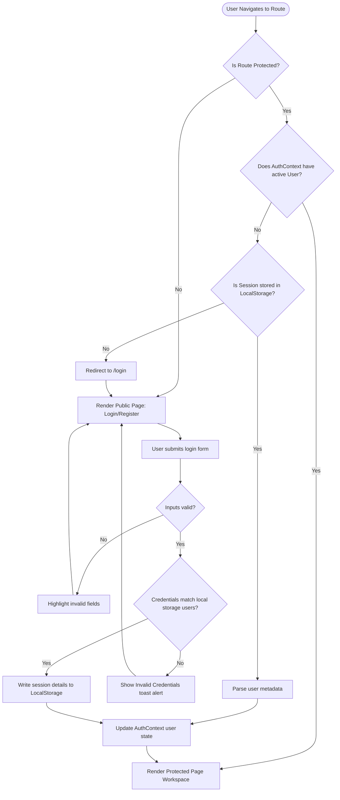

### 10.2 Document Upload & Expiry Tracking Control Flow
This diagram shows the validation and storage steps for file uploads.

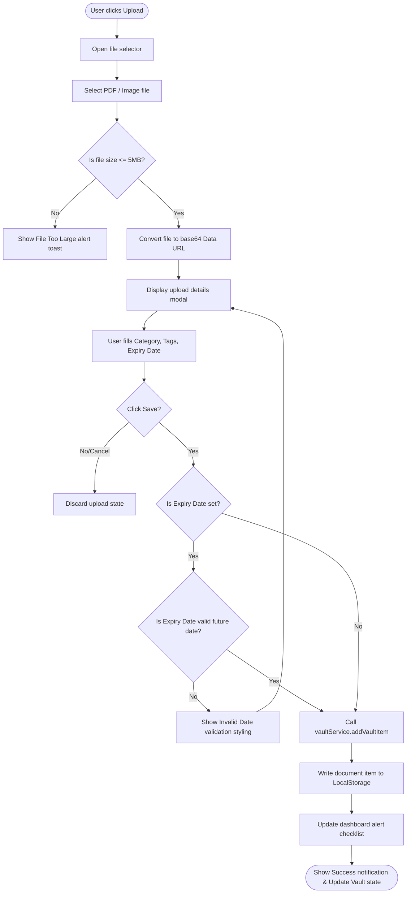

### 10.3 Groq API Key Verification Control Flow
This diagram shows the API key validation steps and model configuration choices.

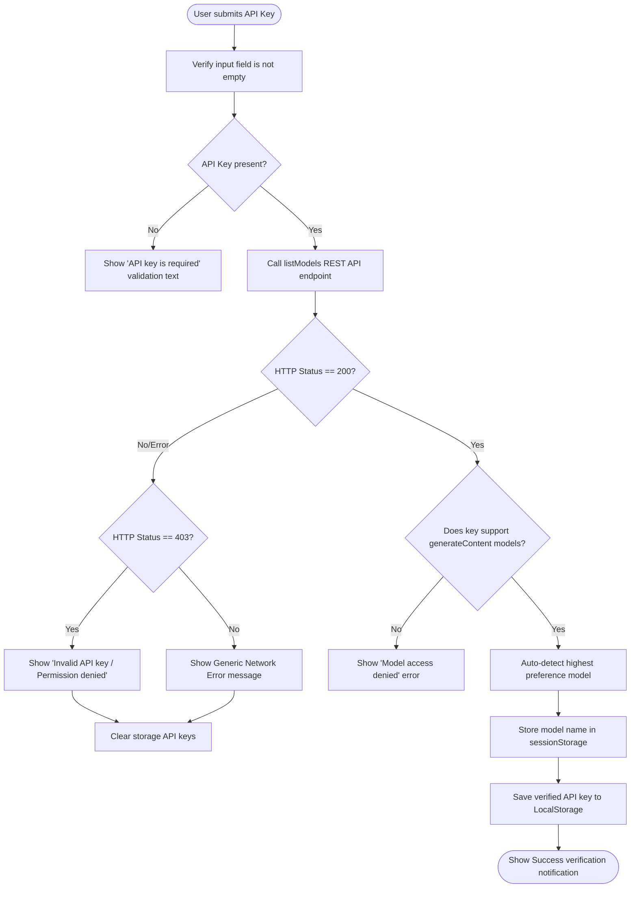

---

## 11. Sequence Diagrams

### 11.1 Login Sequence
This diagram details the interaction sequence for user login.

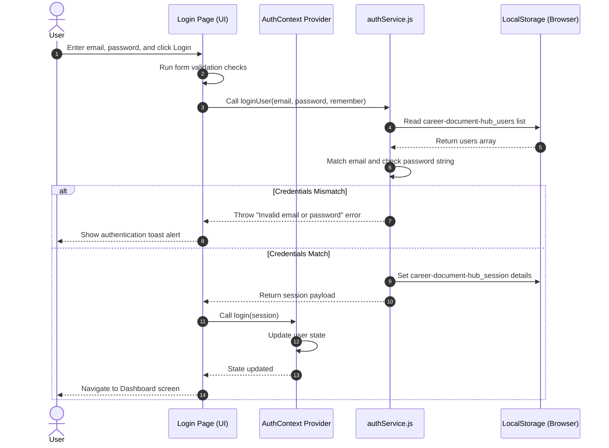

### 11.2 Resume Save Sequence
This diagram outlines how resume inputs are auto-saved.

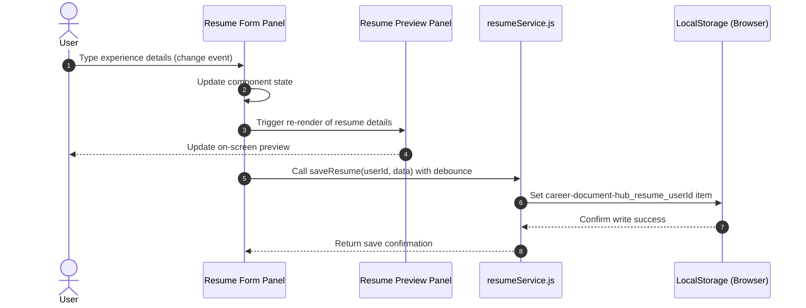

### 11.3 AI Key Verification Sequence
This diagram displays the steps required to verify a user-provided Groq API key.

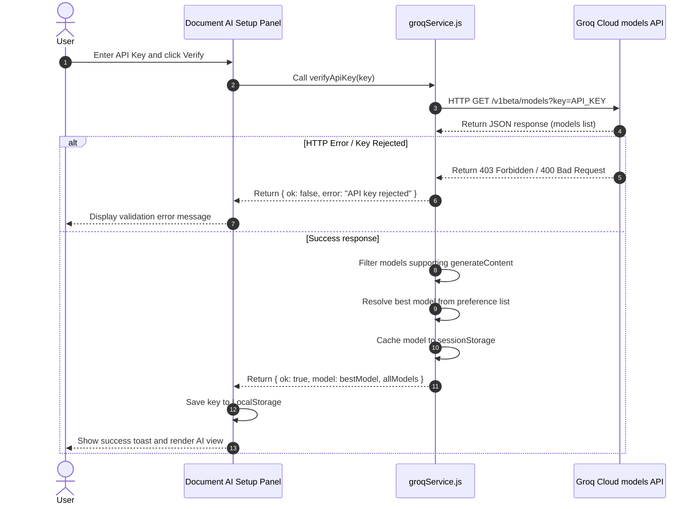

---

## 12. Error Handling Strategy

The application uses local validations to catch errors early, preventing unnecessary API calls and improving the user experience.

### 12.1 Form Validations
*   **Authentication Forms**: Standardizes validation checks for input fields (e.g., minimum character length, proper email formatting). Fields are validated on blur, and error messages are displayed inline with custom styling.
*   **Resume Form Entry**: Experience and education items validate date boundaries to ensure start dates precede end dates.

### 12.2 Document Upload Failures
*   **File Size Checks**: Restricts uploads to a maximum file size of 5MB before conversion to prevent browser memory issues.
*   **Format Safeguards**: File input tags use explicit accept categories (`accept="application/pdf, image/*"`).

### 12.3 Groq API and Key Failures
*   **Dynamic Reset**: If a Groq model request fails with a `404 Not Found` (e.g., if a model is deprecated), the application clears the cached model in `sessionStorage`. This forces a re-query on the next request to resolve a supported model automatically.
*   **Graceful Recovery**: Handles errors like invalid keys (`403`), rate limit exhaustion (`429`), and backend server failures (`500+`) with user-friendly alerts, suggesting actionable next steps.

---

## 13. Known Issues and Lessons Learned

### 13.1 Resume Builder Scroll Synchronization
*   **Issue**: On long resumes, the form edit inputs and the print-preview panel could scroll independently, making it difficult for users to track changes.
*   **Root Cause**: Layout sections lacked coordinated scroll position tracking.
*   **Workaround**: Applied targeted CSS rules (`overflow-y: auto`) to both panels within a flex parent container. This aligns their heights and ensures the preview panel remains visible during edits.

### 13.2 Memory Overhead in Base64 Document Storage
*   **Issue**: Large file uploads caused lag and occasionally crashed the browser session.
*   **Root Cause**: Storing large, uncompressed files as base64 strings in local storage consumes significant memory and quickly exhausts the 5MB browser quota.
*   **Lesson Learned**: Local storage is a temporary solution for Phase 1. The Phase 2 roadmap prioritizes moving file storage to AWS S3, storing only secure URL paths in the database.

### 13.3 Groq API Model Deprecations
*   **Issue**: Hardcoded model names in API requests caused errors when those specific models were deprecated.
*   **Resolution**: Implemented dynamic model resolution. The application queries the `listModels` endpoint using the user's API key to identify accessible models. It then cross-references this list with a local preference configuration to select the best available option.

---

## 14. Architectural Conclusion & Spring Boot Migration Plan

The Phase 1 React frontend is designed with clean boundaries, separating UI logic from data storage. Moving database operations to service adapters makes the application easy to scale.

### 14.1 Spring Boot REST API Target Migration
During the Phase 2 backend migration, the mock data layers will be replaced with REST API integrations using `axios` and Spring Boot endpoints:

```diff
// src/services/vaultService.js
+ import axios from 'axios';
+ const API_URL = import.meta.env.VITE_API_URL || 'http://localhost:8080/api';

export const getVaultItems = async (userId) => {
-  return JSON.parse(localStorage.getItem(getKey(userId)) || '[]');
+  const response = await axios.get(`${API_URL}/vault`, {
+    headers: { Authorization: `Bearer ${localStorage.getItem('token')}` }
+  });
+  return response.data;
};

export const addVaultItem = async (userId, documentData) => {
-  const items = getVaultItems(userId);
-  const newItem = { id: crypto.randomUUID(), ...documentData, createdAt: new Date().toISOString() };
-  items.unshift(newItem);
-  save(userId, items);
-  return newItem;
+  const response = await axios.post(`${API_URL}/vault`, documentData, {
+    headers: { Authorization: `Bearer ${localStorage.getItem('token')}` }
+  });
+  return response.data;
};
```

### 14.2 Architecture Advantages
This separation of concerns allows developers to migrate from local storage to a Spring Boot backend, Redis cache, and vector database without modifying the page UI components. The API client adapter handles the transition seamlessly, ensuring a stable, scalable frontend.
