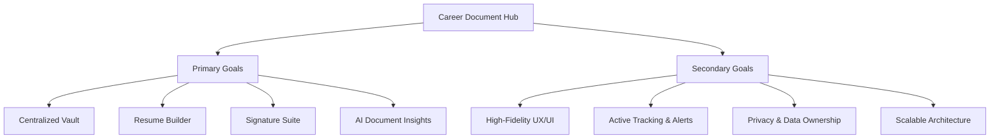
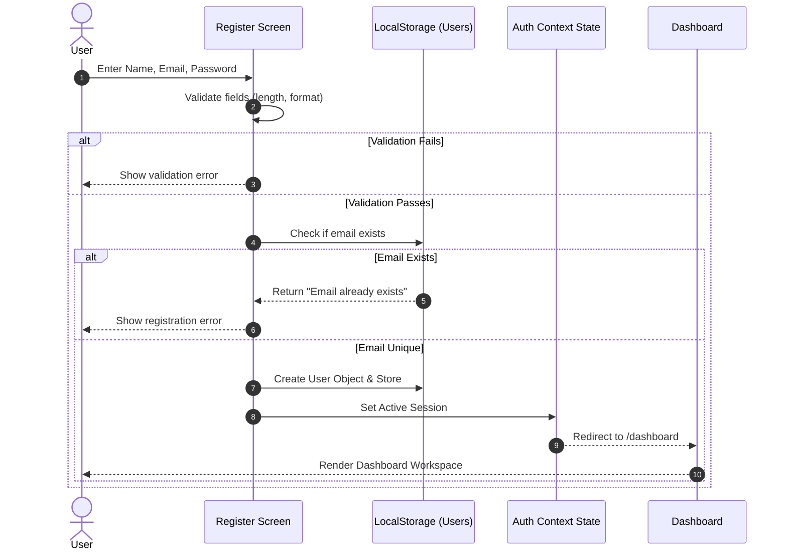
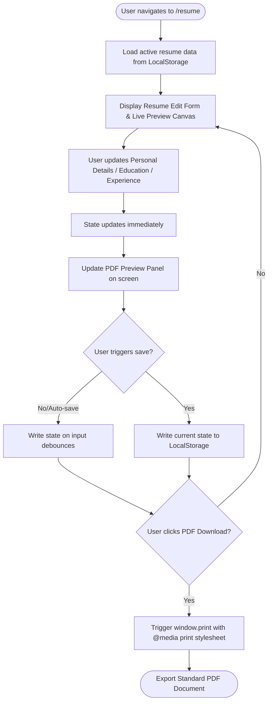
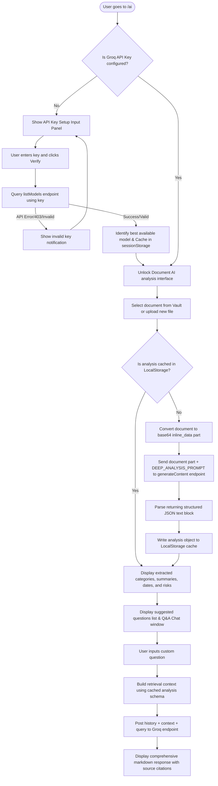

# Product Requirements Document (PRD) — Career Document Hub

## 1. Executive Summary

### 1.1 Project Overview
The **Career Document Hub** is a secure, unified document lifecycle platform designed to streamline how professionals, students, and recruiters manage career credentials, draft resumes, digitally sign contracts, and perform intelligent, AI-driven document analysis. In its initial iteration (Phase 1), the platform is implemented as a premium React-based frontend web application utilizing local storage for session persistence and localized data caching, alongside direct client-side integration with the Google Groq API for deep document understanding.

### 1.2 Problem Statement
Job seekers, students, and working professionals are forced to juggle multiple disjointed tools for daily career-related tasks:
*   **Resume Builders** are often locked behind paywalls, offer poor layouts, or do not save drafts locally.
*   **Document Vaults** (like generic cloud storage) lack contextual tagging, custom metadata (e.g., certification credentials), or automatic expiry tracking.
*   **Digital Signing Tools** are expensive, limited by monthly free-tier restrictions, and difficult to manage.
*   **Document Verification & Understanding** requires manual review of long, complex legal agreements or offer letters, increasing the risk of missing critical notice periods, financial obligations, non-competes, or red flags.

### 1.3 Business Objective
To establish a centralized, free-to-use, developer-friendly utility that eliminates tool fragmentation. By providing a high-fidelity local-first experience with a future path to an enterprise Spring Boot + Redis backend, the business aims to capture user loyalty and create an active user base of career-focused individuals who will transition to collaborative features in later phases.

### 1.4 User Objective
To securely build, store, search, track, and digitally sign all career-critical documents in a single responsive web interface that is optimized for both speed and privacy, with intelligent AI assistance that extracts vital contractual details instantly.

### 1.5 Expected Impact
*   **Efficiency**: Reduces the time to find and verify credentials or sign offer letters from hours to seconds.
*   **Compliance & Awareness**: Prevents expired certifications and legal disputes by tracking certificate validity and highlights "red flag" clauses in employment contracts.
*   **Professionalism**: Empowers candidates to generate standard, ATS-friendly PDF resumes directly from a live-preview builder.

### 1.6 Scope of Current Implementation (Phase 1)
*   **Client-Side Architecture**: Complete React application built on Vite, styled with custom CSS supporting light, dark, and system themes.
*   **Local State & Persistence**: Context API state propagation with complete fallback caching in `localStorage`.
*   **Document Storage & Management**: Categorized file storage (base64 documents and signatures) with dynamic metadata extensions (tags, expiry alert logs).
*   **Interactive Signature Pad**: Custom canvas drawing board and typed/uploaded signature manager.
*   **Client-side RAG & AI QA**: Dynamic auto-discovery of Groq models using the client's API key, document parsing, key-value extraction, and simulated Retrieval-Augmented Generation (RAG) using cached summaries as context.

---

## 2. Product Vision

### 2.1 The "Why"
The Career Document Hub is built to restore control to the user over their professional paperwork. Personal documents are valuable, and analyzing them shouldn't mean sharing them with insecure third-party platforms that harvest candidate data. By using a secure local-first architecture that talks directly to Groq via the user's own API key, we respect user privacy while delivering enterprise-grade AI analytics.

### 2.2 Core Problems Solved
1.  **Fragmented Resume Lifecycle**: Seamlessly transitions from building resumes to saving drafts and exporting clean, standardized PDFs.
2.  **Unstructured Credential Management**: Stores and monitors academic certificates, professional credentials, and transcripts with specific fields (Credential ID, Credential URL, Expiry Date).
3.  **Complex Signature Orchestration**: Bridges the gap between signature preparation (drawing, uploading, typing) and placing signature stamps onto uploaded PDF documents.
4.  **Information Asymmetry in Contracts**: Levels the playing field for candidates by using Groq to extract financial details (notice periods, salaries, probation terms) and highlighting restrictive covenants (non-compete clauses, IP ownership) before signing.
5.  **Certification Expiration Risks**: Employs an active certificate tracker that flags documents expiring within 30 or 90 days.

---

## 3. Product Goals



### 3.1 Primary Goals
*   **Centralized Document Vault**: A structured repository supporting categorization (Academic, Professional, Personal ID, Financial, Medical, Other) and custom search.
*   **Dynamic Resume Builder**: An entry form matching standard ATS sections with a real-time side-by-side preview and one-click print-to-PDF formatting.
*   **Unified Signature Suite**: A signature creation panel supporting three modalities (drawing, typing, and image file uploading) with a visual canvas interface.
*   **In-Browser Document Signer**: A workspace to load PDFs or images, overlay a chosen signature, and download the signed output.
*   **Contextual AI Insights**: A document analysis interface that extracts metadata and supports a RAG-based chat interface regarding the document's contents.

### 3.2 Secondary Goals
*   **Exceptional UI/UX**: Professional, high-contrast, responsive interface supporting smooth micro-animations, transitions, and automatic light/dark theme tracking.
*   **Proactive Document Tracking**: A visual countdown indicator showing validation days left and highlighting critical actions.
*   **Client-Side Privacy**: Ensure sensitive credentials remain inside the client browser, sending only data to Groq via secure, direct HTTPS tunnels.
*   **Modular Extensibility**: Clear separation of concern between services and layout components to allow quick backend swapping (Vite/localStorage to Spring Boot REST endpoints).

---

## 4. User Personas

### 4.1 The Placement-Prep Student (e.g., Priyan)
*   **Demographics**: Final-year Computer Science student.
*   **Needs**: Needs to build a standard resume quickly, keep track of academic transcripts, and organize certificates earned from online platforms (Coursera, Udemy).
*   **Pain Points**: Re-entering the same project details repeatedly, losing track of certificate credential links when applying, and having resumes look unaligned.
*   **Key User Flows**:
    1.  Uses **Resume Builder** to fill out personal details, skills, projects, and education.
    2.  Uses **Document Vault** to upload university marksheets under the "Academic" category.
    3.  Uses **Certificates Tracker** to list certifications with credential links and IDs for quick access during applications.

### 4.2 The Active Working Professional (e.g., Sarah)
*   **Demographics**: Senior Software Engineer transitioning between roles.
*   **Needs**: Wants to verify new offer letters, check notice periods of existing employment agreements, draw and store clean signatures, and sign onboarding documents.
*   **Pain Points**: Signing PDFs on third-party websites that sell contact info, forgetting to verify if non-competes conflict with freelance contracts, and missing document sign deadlines.
*   **Key User Flows**:
    1.  Uploads contract to **AI Insights** to verify the notice period and check for red flags.
    2.  Navigates to **Signature Module** to draw a custom signature and sets it as default.
    3.  Uses **Sign Document** to sign the agreement and downloads the finalized PDF.

### 4.3 The Freelance Recruiter / HR Executive (e.g., Rohit)
*   **Demographics**: Freelance HR Consultant managing candidate onboarding.
*   **Needs**: Reviews candidate resumes for compliance, drafts and signs offer templates, and stores employee IDs securely.
*   **Pain Points**: Juggling dozens of candidate resumes in email threads, verifying if candidates have uploaded active certificates, and manual contract drafting.
*   **Key User Flows**:
    1.  Logs candidate resumes under the **Vault** for review.
    2.  Applies HR signature templates onto candidate offer letters.
    3.  Utilizes **AI Insights** to extract candidate skill matrices and match them against open job descriptions.

---

## 5. Functional Requirements

### 5.1 Authentication Module
*   **FR-AUTH-1**: Users must be able to register a new account using Name, Email, and Password.
*   **FR-AUTH-2**: Users must be able to log in using validated email/password credentials.
*   **FR-AUTH-3**: The interface must support a "Remember Me" checkbox, caching the user's email in local storage.
*   **FR-AUTH-4**: Users must have session persistence, remaining logged in across page refreshes.
*   **FR-AUTH-5**: The navigation bar must display user metadata and offer a clean logout action that clears active sessions.

### 5.2 Dashboard Module
*   **FR-DASH-1**: The dashboard must show high-level summary cards (Total Uploads, Signed Contracts, Active Certificates, Expiring Documents).
*   **FR-DASH-2**: The dashboard must display a checklist of urgent items (e.g., documents expiring within 30 days, unsigned files).
*   **FR-DASH-3**: The dashboard must provide a quick navigation overview of all core sub-systems.

### 5.3 Resume Builder Module
*   **FR-RES-1**: Provide editable sections for Personal Details, Professional Summary, Work Experience, Education, Projects, Skills, and Certifications.
*   **FR-RES-2**: Support adding, updating, and deleting multiple items in repeatable arrays (e.g., adding multiple jobs or projects).
*   **FR-RES-3**: The workspace must present a side-by-side preview panel that updates immediately upon keystroke input.
*   **FR-RES-4**: Save the active resume draft locally to prevent data loss.
*   **FR-RES-5**: Generate clean, ATS-compliant PDF files using browser print styling or dedicated rendering routines.

### 5.4 Document Vault Module
*   **FR-VAULT-1**: Support uploading PDF files and Image files (PNG, JPG) up to 5MB.
*   **FR-VAULT-2**: Allow users to assign files to categories (Personal ID, Academic, Professional, Financial, Medical, Other).
*   **FR-VAULT-3**: Support adding custom tags, text notes, and document expiry dates to each entry.
*   **FR-VAULT-4**: Offer a quick-search filter that updates lists instantly based on title, category, or tag queries.
*   **FR-VAULT-5**: Allow users to star/favorite documents for pin-to-top visualization.
*   **FR-VAULT-6**: Provide full previews for uploaded documents directly within the browser view.

### 5.5 Signature Module
*   **FR-SIG-1**: Provide a canvas drawing board with pen width controls, stroke color selection, and a clear button.
*   **FR-SIG-2**: Support a text-based signature creator where users type their name and choose between multiple handwriting-style fonts.
*   **FR-SIG-3**: Support file uploads for pre-drawn signature image files.
*   **FR-SIG-4**: Support managing multiple signatures, including renaming and setting a "Default Signature".
*   **FR-SIG-5**: Support overlaying signatures onto documents with adjustable size and drag-and-drop coordinates before exporting.

### 5.6 AI Insights Module
*   **FR-AI-1**: Provide an API key registration input field with direct client-side validation against Google's listModels endpoint.
*   **FR-AI-2**: Trigger automated background processing upon document selection, sending document contents along with structured analysis prompts.
*   **FR-AI-3**: Extract and structure crucial details: Executive Summary, Key Dates, Financial Amounts, Risks, Red Flags, and Responsibilities.
*   **FR-AI-4**: Support an interactive Q&A chat interface with a RAG system using the document analysis JSON to answer candidate questions and cite specific sources.
*   **FR-AI-5**: Offer context-aware suggested questions based on the inferred document type.

### 5.7 Profile Module
*   **FR-PROF-1**: Allow users to update their profile name, email, and display avatar.
*   **FR-PROF-2**: Support theme preference selections: Light, Dark, or System Sync.
*   **FR-PROF-3**: Offer account maintenance actions, including clearing data caches or deleting the account.

---

## 6. Non-Functional Requirements

### 6.1 Performance
*   **NFR-PERF-1 (Render Performance)**: All components must render at 60fps. Lists of items must use optimized keys.
*   **NFR-PERF-2 (Asset Footprint)**: Total bundle size must be optimized using Vite's tree-shaking, lazy-loaded page modules, and asset optimization.
*   **NFR-PERF-3 (Offline Speed)**: Local-first local storage operations must execute synchronously in < 10ms.

### 6.2 Scalability
*   **NFR-SCAL-1 (Client Architecture)**: The codebase must separate service interfaces from storage logic (using adapter wrappers), allowing the frontend to switch from localStorage APIs to Spring Boot REST endpoints with minimal modifications.
*   **NFR-SCAL-2 (Model Agnosticism)**: The AI Insights layer must resolve model support dynamically, making the code compatible with future Groq releases without code updates.

### 6.3 Security
*   **NFR-SEC-1 (API Key Isolation)**: Groq API keys must reside exclusively in client local storage and must never be logged or sent to third-party endpoints.
*   **NFR-SEC-2 (No Server Middlemen)**: All API payloads must travel directly between the client browser and `googleapis.com` via TLS 1.3.
*   **NFR-SEC-3 (Credential Exposure Prevention)**: Password inputs must mask entries during authentication, and context profiles must scrub passwords from runtime state models.

### 6.4 Accessibility (a11y)
*   **NFR-A11Y-1 (Contrast compliance)**: Color schemes must conform to WCAG 2.1 AA contrast levels (minimum 4.5:1 ratio for text).
*   **NFR-A11Y-2 (Semantic HTML)**: All forms, buttons, and input elements must use semantic elements (`<button>`, `<input>`, `<label>`, `<main>`, `<nav>`) with active hover and focus states.

### 6.5 Responsiveness
*   **NFR-RESP-1 (Fluid Breakpoints)**: The layout must adjust automatically across mobile, tablet, and desktop viewports (320px to 1920px).
*   **NFR-RESP-2 (Sidebar Collapsibility)**: The main navigation layout must transition to a compact sidebar or drawer overlay on smaller screens.

### 6.6 Maintainability
*   **NFR-MNT-1 (Folder Conventions)**: Strictly enforce a modular folder structure dividing components, page views, routing configurations, hooks, context layers, CSS modules, and mock data services.
*   **NFR-MNT-2 (Style Scope)**: Use clean, structured CSS containing root custom properties to isolate styling variables from logic.

---

## 7. User Journeys

This section illustrates critical paths users take through the application.

### 7.1 User Registration and Onboarding Flow
Describes the path a new user takes to set up an account, log in, and customize settings.



### 7.2 Resume Creation Flow
Describes the workflow for creating, previewing, and downloading a custom resume.



### 7.3 Document Upload and Expiry Setup Flow
Demonstrates uploading a document to the vault, setting categorization, and creating an expiry tracker event.

```mermaid
flowchart TD
    A([User navigates to /vault]) --> B[Click "Upload Document" Button]
    B --> C[Select File: PDF or Image]
    C --> D[System reads file as base64 Data URL]
    D --> E[User completes form: Name, Category, Tags, Notes, Expiry Date]
    E --> F{Validate Form?}
    F -- Invalid --> G[Show inline error styling]
    G --> E
    F -- Valid --> H[Call vaultService.addVaultItem]
    H --> I[Store item in career-document-hub_vault_userId key]
    I --> J[Update global Document list state]
    J --> K[Re-evaluate expiry tracking alerts]
    K --> L([Success Toast & Return to Vault overview])
```

### 7.4 Signature Creation and Sign-Overlay Flow
Traces how a user establishes their digital signature and applies it to an unsigned document.

```mermaid
flowchart TD
    Step1([User goes to /signatures]) --> Step2[Select Draw, Type, or Upload Signature]
    Step2 --> Step3{Signature Mode?}
    
    Step3 -- Draw --> Pad[Draw signature on canvas pad]
    Step3 -- Type --> FontSelect[Type name & choose calligraphy font style]
    Step3 -- Upload --> UploadSig[Select pre-drawn transparent PNG signature file]

    Pad & FontSelect & UploadSig --> SaveSig[Save signature base64 string to LocalStorage]
    SaveSig --> ListSig[Update available signatures list]
    
    ListSig --> SignNav([User navigates to /documents and selects a document])
    SignNav --> LoadDoc[Load original document in editor workspace]
    LoadDoc --> ChooseSig[Select default or custom signature stamp]
    ChooseSig --> PositionSig[Drag, drop, and resize signature stamp onto the document page]
    PositionSig --> Burn[Click "Sign Document"]
    Burn --> ExportDoc[Merge signature canvas with document canvas]
    ExportDoc --> SaveDoc[Save signedDataUrl and date signed to LocalStorage]
    SaveDoc --> DownloadDoc([Download signed document output])
```

### 7.5 Groq AI Key Setup and Document Analysis Flow
Illustrates the user journey of registering an API key, verifying it, uploading a document, and engaging in context-aware Q&A chat.



---

## 8. Future Product Roadmap

The Career Document Hub is designed to evolve from a local-first utility to an enterprise SaaS platform.

### Phase 2: Enterprise Backend Integration (Spring Boot REST APIs)
*   **Goal**: Transition from client-side `localStorage` to a secure Spring Boot microservice stack.
*   **Features**:
    *   JWT-based authentication with bcrypt password hashing.
    *   PostgreSQL database schema for secure storage of user metadata, profile information, and document references.
    *   File storage integration with AWS S3 or Google Cloud Storage.
    *   Secure backend proxying of all Groq API requests to hide API keys from the client build.

### Phase 3: Performance Optimization & Redis Caching
*   **Goal**: Minimize database lookups, implement distributed session tracking, and cache expensive operations.
*   **Features**:
    *   Redis caching of resolved user sessions and profile details.
    *   Caching computed AI analysis models for frequently processed document hashes.
    *   Redis Pub/Sub support to handle background file scanning tasks asynchronously.

### Phase 4: AI Document Intelligence Suite
*   **Goal**: Move beyond static prompt extraction to active OCR document parsing.
*   **Features**:
    *   Integration of Google Cloud Document AI for specialized processing of resumes, government IDs, and tax documents.
    *   Advanced entity extraction and verification (cross-checking names, dates, and amounts against user profiles).
    *   Support for parsing scans and high-resolution camera uploads.

### Phase 5: RAG-Based Document Search
*   **Goal**: Search across the entire vault using natural language semantic queries.
*   **Features**:
    *   Backend vector database integration (e.g., PostgreSQL pgvector, Pinecone, or Milvus).
    *   Document text extraction, chunking, and embedding generation via Groq text-embedding models.
    *   Context-aware search interface: "Find the contract that mentions my 30-day notice period."

### Phase 6: Cryptographic Signature Verification
*   **Goal**: Add authenticity verification to signed documents.
*   **Features**:
    *   X.509 digital certificate generation for authenticated users.
    *   Embedding cryptographic signatures (PAdES standard) into PDF files.
    *   Providing a public verification page where third parties can drop a signed PDF to verify its authenticity and check for tampering.

### Phase 7: Collaborative Workspaces
*   **Goal**: Turn the document vault into an interactive corporate onboarding platform.
*   **Features**:
    *   Shared folders with role-based access controls (Owner, Viewer, Signer).
    *   Document signing requests sent directly via email link.
    *   Real-time activity logs and audit trails detailing who viewed, edited, or signed a document.

---

## 9. Conclusion
The **Career Document Hub** solves a real, daily administrative struggle for professionals and students: managing personal paperwork safely. Its current architecture establishes a solid, responsive interface, providing rich visual indicators, a flexible resume builder, a complete signature utility, and direct AI document query tools.

Designed with strict separation of concerns, Phase 1 sets up a clean, scalable codebase. By isolating storage, authentication, and AI routing into specialized service abstractions, the platform is prepared for rapid migration to a Spring Boot microservice backend, making it a reliable and scalable foundation for a modern enterprise application.
