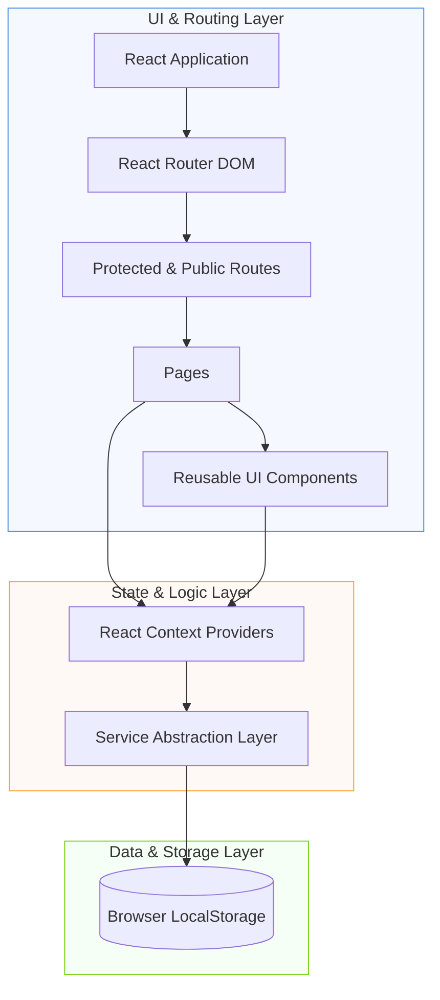
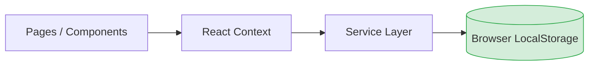
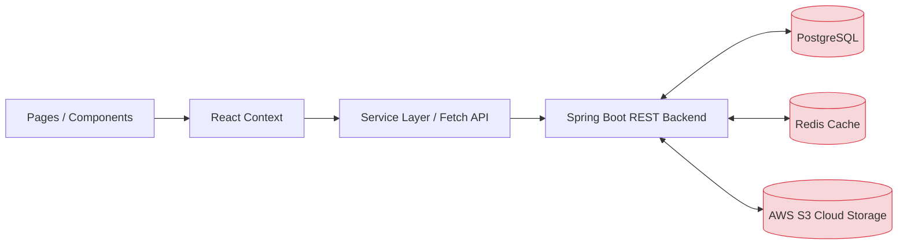

# Repository Overview

## Purpose

This document provides a high-level conceptual overview of the project, answering the core question: **"What is this project?"** before deep-diving into individual components, pages, or services.

---

## Scope

This document intentionally focuses only on the repository-level overview.

It does **not** describe:
- Individual components
- Page implementations
- Service details
- Routing configurations
- Context mechanisms
- Specific dependency relationships

These details are covered in subsequent audit documents.

---

## Contents

### 1. Project Identity

The project currently uses multiple naming conventions across different contexts. Standardizing these names will improve consistency and structure across the repository.

| Property | Current Value | Recommendation / Status |
| :--- | :--- | :--- |
| **Repository Name** | `career-document-hub` | **Target Standard Name** |
| **Folder Name** | `career-document-hub` | Rename to match repository name |
| **Package Name** | `career-document-hub` (`package.json`) | Update to match repository name |
| **Product Name** | `Career Document Hub` | User-facing product branding |

### 2. Product Category

The application is classified as an **AI-powered Career Document Management Platform**. Rather than a simple document-signing app, it serves as a central hub combining several key career management and document utility domains:

*   📝 **Resume Builder:** Interactive creation, editing, and formatting of professional resumes.
*   🔒 **Document Vault:** Secure storage, listing, and organization of career-related documents.
*   🎓 **Certificate Management:** Uploading, organizing, and verifying certificates and credentials.
*   ✍️ **Digital Signature:** Local preparation, drawing, and embedding of digital signatures into documents.
*   🤖 **AI Document Analysis:** Intelligent parsing, summaries, and suggestions for resumes and documents powered by the Groq Cloud API.
*   📂 **Document Organization:** Category filtering, search capabilities, and tag association.
*   💼 **Career Management:** Tracking job applications, documents, and overall career progression assets.

### 3. Current Development Stage

The application is currently in a **Frontend-Complete, Local-First** state. Development of server-side APIs, cloud storage integrations, and relational database layers has not yet begun, aligning with the early phases of the project roadmap.

| Component / Layer | Status | Implementation Details |
| :--- | :--- | :--- |
| **Frontend UI/UX** | 🟢 Mostly Complete | React 18, Tailwind/Vanilla CSS, page views fully mapped |
| **Authentication** | 🟡 Mock / Local | LocalStorage-based session management |
| **State & Services** | 🟢 Complete (Local) | Custom Context API Providers + LocalStorage-backed service layer |
| **Spring Boot Backend**| 🔴 Not Started | Future Phase Target |
| **Database (PostgreSQL)**| 🔴 Not Started | Future Phase Target |
| **Caching (Redis)** | 🔴 Not Started | Future Phase Target |
| **Cloud Storage (S3)** | 🔴 Not Started | Future Phase Target |

### 4. Technology Stack

The application's current frontend stack relies on modern React ecosystem utilities:

*   **Core Library & Bundler:** React 18, Vite
*   **Routing:** React Router DOM (v6)
*   **State Management:** React Context API (Service-oriented design)
*   **Styling:** CSS Modules / Vanilla CSS
*   **Form Management:** React Hook Form
*   **Toast Notifications:** React Hot Toast
*   **PDF Generation & Printing:** React PDF, React To Print
*   **File Interactions:** React Dropzone
*   **Signature Canvas:** React Signature Canvas
*   **Icon Library:** Lucide React
*   **Artificial Intelligence:** Groq Cloud API (integrated via custom service layer supporting Llama & Mixtral models)

### 5. Build System

The build system utilizes **Vite**, offering a fast and modern frontend developer experience.

| Script Command | Purpose |
| :--- | :--- |
| `npm run dev` | Launches the local Vite development server with Hot Module Replacement (HMR) |
| `npm run build` | Compiles and optimizes assets into a production-ready `/dist` bundle |
| `npm run preview` | Spins up a local server to preview the production-built `/dist` assets |
| `npm run lint` | Runs ESLint configuration to verify syntax and enforce code quality rules |

### 6. Project Structure

The codebase is organized in a highly clean and modular pattern:

```text
career-document-hub/
├── public/                 # Static public assets (logos, icons, external scripts)
├── src/
│   ├── assets/             # Global visual assets, images, and fonts
│   ├── components/         # Reusable, stateless or UI-only components (buttons, modals)
│   ├── context/            # React Context providers representing domain-specific states
│   ├── pages/              # Composite layout views corresponding to routes (Dashboard, Vault, etc.)
│   ├── routes/             # Client-side router declarations and route guards
│   ├── services/           # Services encapsulating localStorage, Gemini API, and business logic
│   └── styles/             # Global stylesheets and CSS variables
├── package.json            # NPM dependencies and script definitions
├── vite.config.js          # Vite bundler configurations
├── README.md               # Standard development quickstart guide
├── PRD.md                  # Product Requirements Document
└── Frontend-Technical-Design.md # Technical implementation details
```

### 7. Design Philosophy

All architecture decisions are guided by these core principles:
*   **Local-First Architecture:** Keeps data in the browser (LocalStorage) for low latency, offline-friendly interaction, and fast prototyping.
*   **Modular Component Design:** Breaks user interfaces into atomic, highly reusable parts.
*   **Service-Oriented Frontend:** Decouples API calls and storage routines from context states and component classes.
*   **Future Backend Compatibility:** Structures services and states so they can easily switch to server-side database connections.

---

## Diagrams

### 1. Architecture Style

The application implements a **layered, decoupled frontend architecture**. This structure isolates UI components from storage operations, ensuring business logic resides within dedicated services.



### 2. Storage Strategies

#### Current Architecture (Local-First Flow)

*Stores: User sessions, resumes, vault documents, certificates, drawn signatures, and cached AI results.*

#### Intended Future Architecture (Backend Integrated Flow)


---

## Observations

- **Modular Folder Layout:** Highly clean and descriptive folder breakdown (`src/components`, `src/pages`, `src/services`, etc.).
- **Decoupled Business Logic:** Clear boundary between view rendering (UI component layer) and business logic/persistence actions (Services layer).
- **React Context State Separation:** Context handles shared state efficiently without excessive prop drilling.
- **Modern Tooling:** Quick compilations and hot reloads utilizing Vite.
- **Excellent Pre-planning Documentation:** Complete PRD and Technical Design files outline clear long-term project directions.
- **Naming Inconsistencies:** Use of `career-document-hub` in folder and package config vs. `career-document-hub` repository branding.

---

## Recommendations

These items are mapped to guide development in subsequent phases of the project:

1.  **Standardize Project Names:** Rename directory folders and package settings to align strictly to `career-document-hub`.
2.  **Schema / Type Safety:** Introduce TypeScript support or schema validation (e.g., Zod) to validate incoming files and ensure strong client-side contracts.
3.  **Comprehensive Test Suites:** Set up a testing runner (such as Vitest) and implement unit and integration testing workflows for context actions and service files.
4.  **Dedicated API Contract Phase:** Formally define the backend JSON payloads (REST API schemas/OpenAPI standard) before beginning backend development in Spring Boot.

---

## References

- [PRD.md](file:///c:/Users/preeti.tewatia/.gemini/antigravity/scratch/career-document-hub/PRD.md)
- [Frontend-Technical-Design.md](file:///c:/Users/preeti.tewatia/.gemini/antigravity/scratch/career-document-hub/Frontend-Technical-Design.md)
- [package.json](file:///c:/Users/preeti.tewatia/.gemini/antigravity/scratch/career-document-hub/package.json)
- [vite.config.js](file:///c:/Users/preeti.tewatia/.gemini/antigravity/scratch/career-document-hub/vite.config.js)

---

## Glossary

| Term | Meaning |
| :--- | :--- |
| **Context** | React global state provider |
| **Service** | Business logic abstraction |
| **Page** | Route-level component |
| **Component** | Reusable UI element |
| **Vault** | Secure document storage module |

---

## Revision History

| Version | Date | Author | Changes |
| :--- | :--- | :--- | :--- |
| 1.0.0 | 2026-06-29 | Preeti Tewatia | Initial repository overview |
| 1.1.0 | 2026-06-30 | Preeti Tewatia | Migrated AI engine to Groq Cloud API, resolved PDF loop, and added signature customizer |
