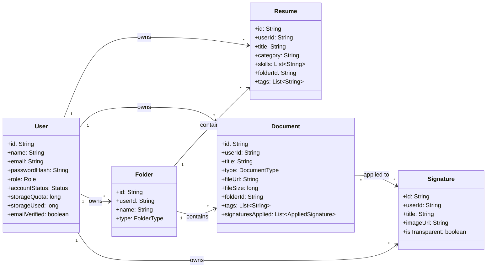

# Domain Model — Career Document Hub

This document defines the core business entities ("nouns") of the Career Document Hub backend and illustrates their relationships.

---

## 1. Domain Entities

---

## 2. Entity Specifications

### A. User
Represents a registered account.
*   **Fields**:
    *   `id`: Unique identifier (String)
    *   `name`: Full display name (String)
    *   `email`: Email address used for authentication (String, Unique)
    *   `passwordHash`: BCrypt-hashed password (String)
    *   `role`: User authorization level (`USER`, `ADMIN`)
    *   `accountStatus`: Lifecycle state (`ACTIVE`, `SUSPENDED`, `BLOCKED`)
    *   `storageQuota`: Max storage allowed in bytes (default: `2,147,483,648` bytes = 2GB)
    *   `storageUsed`: Current storage occupied in bytes (long)
    *   `emailVerified`: Verification flag (boolean)
    *   `lastLogin`: Timestamp of the last sign-in (LocalDateTime)

---

### B. Resume
A specialized document that users edit, export to PDF, scan for ATS scoring, and optimize via AI.
*   **Fields**:
    *   `id`: Unique identifier (String)
    *   `userId`: Owner ID (String)
    *   `title`: Display name (e.g., "React Frontend Developer Resume")
    *   `category`: Primary discipline (e.g., "Frontend", "Backend", "AI/ML")
    *   `skills`: List of extracted tech skills (List of Strings)
    *   `folderId`: Target folder (String, Optional)
    *   `tags`: Custom keywords for filtering (List of Strings)
    *   `content`: Full resume structure containing summary, work experience, education, projects, etc. (Nested Object/JSON)

---

### C. Document
A generic uploaded file (Aadhaar, PAN card, experience letters, certificates, NDAs). Can be digitally signed.
*   **Fields**:
    *   `id`: Unique identifier (String)
    *   `userId`: Owner ID (String)
    *   `title`: Filename or display name (String)
    *   `type`: Broad classification (`IDENTIFICATION`, `EMPLOYMENT`, `EDUCATION`, `FINANCE`, `OTHER`)
    *   `fileUrl`: S3/GridFS file link (String)
    *   `fileSize`: Size of file in bytes (long)
    *   `folderId`: Target folder (String, Optional)
    *   `tags`: Custom labels (List of Strings)
    *   `signaturesApplied`: Records of applied signatures (List of AppliedSignature embedded objects)

---

### D. Folder
User-created workspace folders to group resumes and documents.
*   **Fields**:
    *   `id`: Unique identifier (String)
    *   `userId`: Owner ID (String)
    *   `name`: Folder display name (String)
    *   `type`: Type of content allowed (`RESUMES`, `DOCUMENTS`, `MIXED`)

---

### E. Signature
Stored digital signature images that can be applied to PDF documents.
*   **Fields**:
    *   `id`: Unique identifier (String)
    *   `userId`: Owner ID (String)
    *   `title`: Display name (String)
    *   `imageUrl`: Link to signature image (String)
    *   `isTransparent`: Flag indicating if the background was removed (boolean)

---

## 3. Key Architecture Decisions

1.  **Resume vs. Document Separation**: While both represent files, a `Resume` has a highly structured lifecycle (ATS scoring, AI processing, templates, sections), whereas a `Document` is static and supports digital signatures. Keeping them as distinct entities prevents schema pollution and simplifies feature scaling.
2.  **Referenced Folders & Tags**: Resumes and documents reference folders via `folderId`, and contain inline arrays of `tags`. This keeps relationships lightweight and search/filter performance fast under MongoDB indexing.
