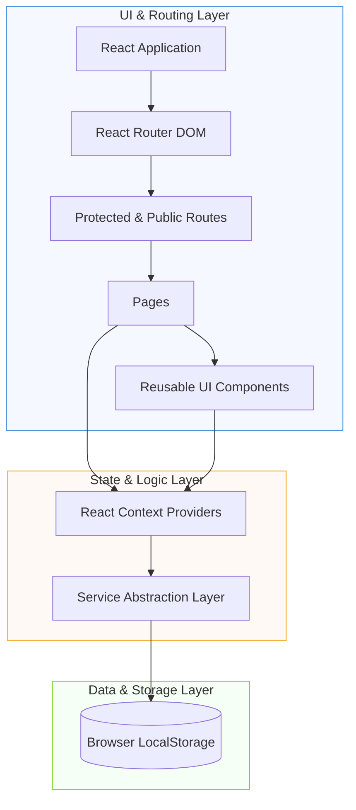
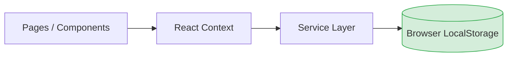
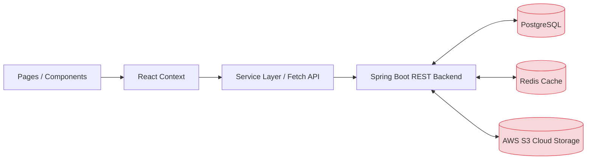

# Repository Audit — Phase 1
## Repository Overview

> [!NOTE]
> This document provides a high-level conceptual overview of the project, answering the core question: **"What is this project?"** before deep-diving into individual components, pages, or services.

---

### Navigation
| Previous | Current | Next |
| :--- | :--- | :--- |
| *None* | **01 Repository Overview** | [02 Folder Structure](file:///C:/Users/preeti.tewatia/.gemini/antigravity/scratch/career-document-hub/docs/audit/02_FOLDER_STRUCTURE.md) |

---

## Scope

This document intentionally focuses only on the repository-level overview.

It does **not** describe:
- Individual UI components
- Page implementations
- Service details
- Routing configurations
- Context mechanisms
- Specific dependency relationships

These details are covered in subsequent audit documents.

---

### 1. Project Identity

The project uses unified naming conventions across all scopes to ensure alignment and eliminate confusion.

| Property | Value | Status |
| :--- | :--- | :--- |
| **Repository Name** | `career-document-hub` | Target standard matched |
| **Folder Name** | `career-document-hub` | Renamed and standardized |
| **Package Name** | `career-document-hub` (`package.json`) | Updated and standardized |
| **Product Name** | `Career Document Hub` | User-facing branding aligned |

---

### 2. Product Category

The application is classified as an **AI-powered Career Document Management Platform**. Rather than a simple document-signing app, it serves as a central hub combining several key career management and document utility domains:

*   📝 **Resume Builder:** Interactive creation, editing, and formatting of professional resumes.
*   🔒 **Document Vault:** Secure storage, listing, and organization of career-related documents.
*   🎓 **Certificate Management:** Uploading, organizing, and verifying certificates and credentials.
*   ✍️ **Digital Signature:** Local preparation, drawing, and embedding of digital signatures into documents.
*   🤖 **AI Document Analysis:** Intelligent parsing, summaries, and suggestions for resumes and documents powered by the Groq Cloud API.
*   📂 **Document Organization:** Category filtering, search capabilities, and tag association.
*   💼 **Career Management:** Tracking job applications, documents, and overall career progression assets.

---

### 3. Current Development Stage

The application is currently in a **Frontend-Complete, Local-First** state. Development of server-side APIs, cloud storage integrations, and relational database layers has not yet begun, aligning with the early phases of the project roadmap.

| Component / Layer | Status | Implementation Details |
| :--- | :--- | :--- |
| **Frontend UI/UX** | 🟢 Mostly Complete | React 18, Vanilla CSS variables, page views fully mapped |
| **Authentication** | 🟡 Mock / Local | LocalStorage-based session management |
| **State & Services** | 🟢 Complete (Local) | Custom Context API Providers + LocalStorage-backed service layer |
| **Spring Boot Backend**| 🔴 Not Started | Future Phase Target |
| **Database (PostgreSQL)**| 🔴 Not Started | Future Phase Target |
| **Caching (Redis)** | 🔴 Not Started | Future Phase Target |
| **Cloud Storage (S3)** | 🔴 Not Started | Future Phase Target |

---

### 4. Repository Statistics Snapshot

This snapshot details the quantities of files and elements comprising the frontend repository at the end of Phase 1:

| Artifact Type | Count | Description |
| :--- | :--- | :--- |
| **Pages** | 12 | Route-bound layout containers (Dashboard, Resume, DocumentAI, etc.) |
| **Components** | 53 | Reusable atomic UI elements (Buttons, Section Accordions, Modals) |
| **Hooks** | 6 | Custom state hooks isolating UI render parameters from service controls |
| **Contexts** | 2 | Global providers (`AuthContext`, `ThemeContext`) |
| **Services** | 7 | Local-first data operations & API integration wrappers |
| **Styles** | 22 | Normalization sheets, themes mapping, and module stylesheets |
| **Documentation** | 5 | Technical guides, PRDs, and repository logs |

---

### 5. Repository Maturity Level

Visual matrix outlining the maturity stage of each core system component:

| Domain | Maturity | Visual Rating |
| :--- | :--- | :--- |
| **Architecture Layout** | Good | ★★★★☆ |
| **Documentation Suite** | Good | ★★★★☆ |
| **Testing Coverage** | Not Started | ☆☆☆☆☆ |
| **Backend Integration** | Not Started | ☆☆☆☆☆ |
| **Frontend UI/UX** | Good | ★★★★☆ |
| **Deployment / CI-CD** | Not Started | ☆☆☆☆☆ |

---

### 6. Architectural Decisions (ADR)

*   **AD-001: React Context API over Redux**
    *   *Reasoning*: The current project size and local-first session models do not require the overhead of Redux or Recoil. React Context API provides lightweight, efficient state propagation.
*   **AD-002: LocalStorage Decoupling via Services**
    *   *Reasoning*: Components never read/write `localStorage` directly. All operations are isolated inside a Service Layer (`vaultService.js`, `resumeService.js`, etc.) so we can swap them for HTTP REST API requests in Phase 2 with zero modifications to the UI layer.
*   **AD-003: Vite for Build & Bundling**
    *   *Reasoning*: Vite provides instantaneous Hot Module Replacement (HMR) and optimized Rolldown-based build bundles, significantly outperforming Create React App (CRA).

---

### 7. Technology Stack

The application's current frontend stack relies on modern React ecosystem utilities:

*   **Core Library & Bundler:** React 18, Vite
*   **Routing:** React Router DOM (v6)
*   **State Management:** React Context API (Service-oriented design)
*   **Styling:** Pure Vanilla CSS (CSS Custom Properties)
*   **Form Management:** React Hook Form
*   **Toast Notifications:** React Hot Toast
*   **PDF Generation & Printing:** React PDF, React To Print
*   **File Interactions:** React Dropzone
*   **Signature Canvas:** React Signature Canvas
*   **Icon Library:** Lucide React
*   **Artificial Intelligence:** Groq Cloud REST API (Llama & Mixtral models)

---

### 8. Build System

The build system utilizes **Vite**, offering a fast and modern frontend developer experience. Note that all build scripts must be executed inside the `frontend/` subdirectory:

| Script Command | Purpose |
| :--- | :--- |
| `npm run dev` | Launches the local Vite development server with Hot Module Replacement (HMR) |
| `npm run build` | Compiles and optimizes assets into a production-ready `/dist` bundle |
| `npm run preview` | Spins up a local server to preview the production-built `/dist` assets |
| `npm run lint` | Runs ESLint configuration to verify syntax and enforce code quality rules |

---

### 9. Architecture Style

The application implements a **layered, decoupled frontend architecture**. This structure isolates UI components from storage operations, ensuring business logic resides within dedicated services.



**Benefits of this Architecture:**
1.  **Separation of Concerns:** Pages and UI components focus entirely on rendering layout and collecting user events.
2.  **No Direct Storage Manipulation:** UI components never write directly to localStorage; they coordinate via services.
3.  **Migration Readiness:** The service abstraction layer makes it extremely straightforward to swap out browser-based services (e.g., local storage) for REST/HTTP services communicating with a Spring Boot backend.

---

### 10. Project Structure

The codebase is organized in a highly clean and modular pattern:

```text
career-document-hub/
├── frontend/               # Relocated Frontend React Application
│   ├── public/             # Static public assets (logos, icons, external scripts)
│   ├── src/
│   │   ├── assets/         # Global visual assets, images, and fonts
│   │   ├── components/     # Decomposed atomic UI components (buttons, modals, sections)
│   │   ├── context/        # React Context providers representing domain-specific states
│   │   ├── hooks/          # Custom React hooks (useResumeState, useChatState, useDocumentAIState)
│   │   ├── pages/          # Modular route layout pages (strictly under 150 lines)
│   │   ├── routes/         # Client-side router declarations and route guards
│   │   ├── services/       # Services encapsulating local storage & Groq API adapters
│   │   ├── styles/         # Global stylesheets and CSS variables
│   │   └── utils/          # Auxiliary helper algorithms (signatureMerger)
│   ├── package.json        # NPM dependencies and script definitions
│   └── vite.config.js      # Vite bundler configurations
├── docs/                   # Documentation and repository audit audits
├── README.md               # Standard development quickstart guide
├── PRD.md                  # Product Requirements Document
└── Frontend-Technical-Design.md # Technical implementation details
```

---

### 11. Design Philosophy

All architecture decisions are guided by these core principles:
*   **Local-First Architecture:** Keeps data in the browser (LocalStorage) for low latency, offline-friendly interaction, and fast prototyping.
*   **Modular Component Design:** Breaks user interfaces into atomic, highly reusable parts.
*   **Service-Oriented Frontend:** Decouples API calls and storage routines from context states and component classes.
*   **Future Backend Compatibility:** Structures services and states so they can easily switch to server-side database connections.

---

### 12. Current & Future Storage Strategy

#### Current Architecture (Local-First Flow)



*Stores: User sessions, resumes, vault documents, certificates, drawn signatures, and cached AI results.*

#### Intended Future Architecture (Backend Integrated Flow)



---

### 13. Current Risks & Assumptions

#### Risks
- **No Backend Persistence**: Active storage is local-only; users lose data if they clear browser cache.
- **No Automated Testing**: Lack of unit/integration test suites makes it difficult to detect regressions.
- **LocalStorage Limits**: File storage is constrained to 5MB total browser limit; large base64 uploads can cause QuotaExceeded errors.

#### Assumptions
- Spring Boot REST APIs will handle standard persistence in Phase 2.
- Redis will cache sessions, rate limit API hits, and store document metadata.
- AWS S3 will host actual PDFs and images, avoiding database bloating.

---

### 14. References

- [PRD.md](../../PRD.md)
- [Frontend-Technical-Design.md](../../Frontend-Technical-Design.md)
- [package.json](../../frontend/package.json)
- [vite.config.js](../../frontend/vite.config.js)

---

### 15. Glossary

| Term | Meaning |
| :--- | :--- |
| **Context** | React global state provider |
| **Service** | Business logic abstraction |
| **Page** | Route-level component |
| **Component** | Reusable UI element |
| **Vault** | Secure document storage module |
| **RAG** | Retrieval-Augmented Generation (context-injected AI queries) |
| **DTO** | Data Transfer Object (request/response models) |
| **Local-first** | Architecture pattern storing state in client storage by default |

---

### 16. Revision History

| Version | Date | Author | Changes |
| :--- | :--- | :--- | :--- |
| 1.0.0 | 2026-06-29 | Preeti Tewatia | Initial repository overview |
| 1.1.0 | 2026-06-30 | Preeti Tewatia | Updated project layout mappings, documented Groq integration, and added statistics/risks analysis. |
